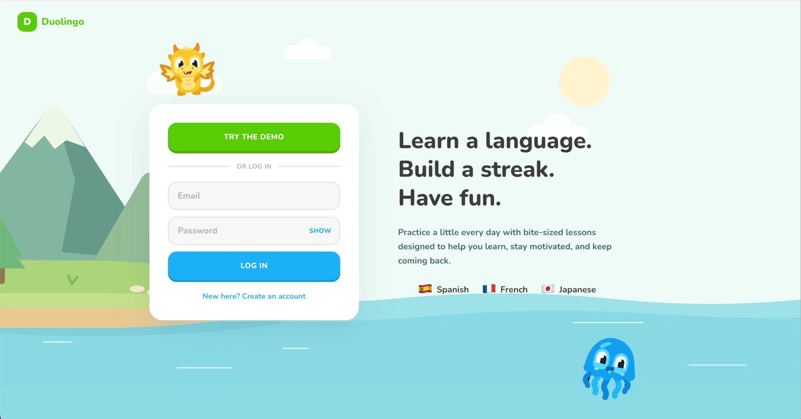
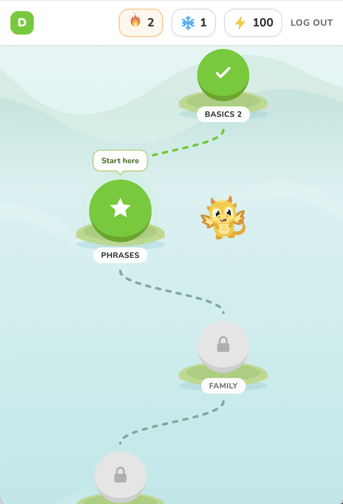
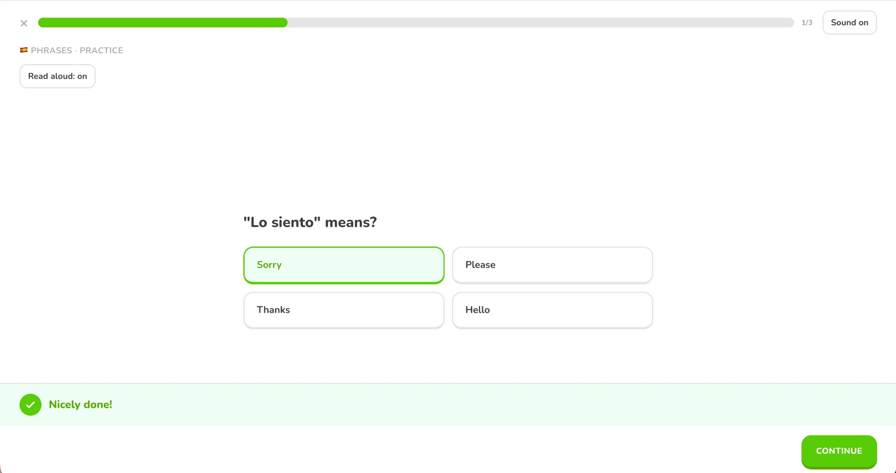
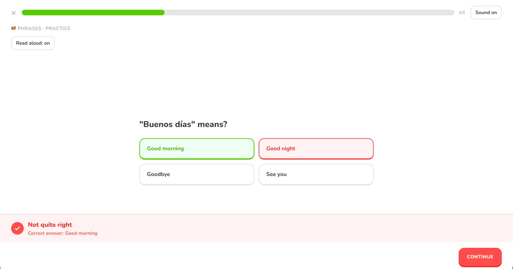
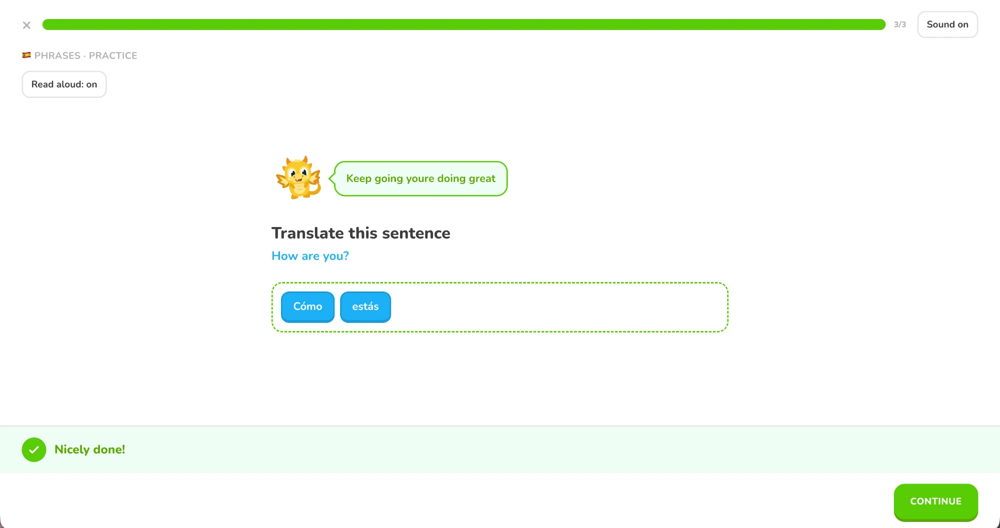
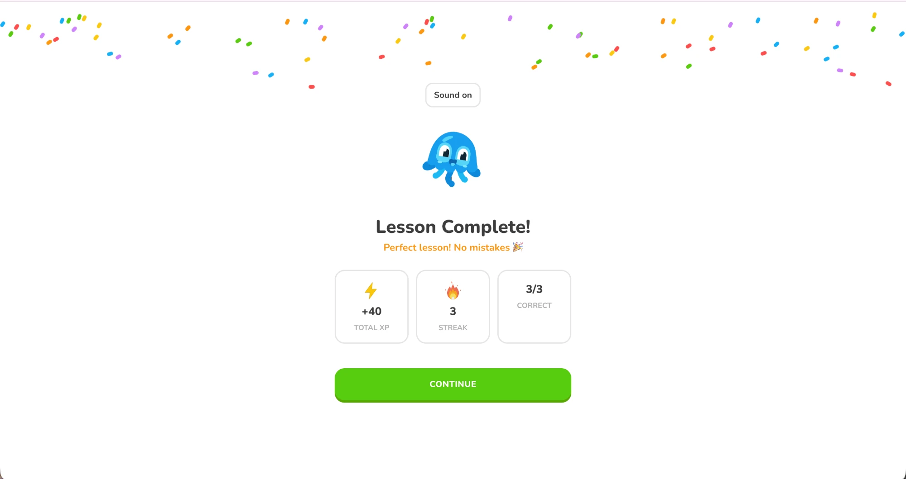
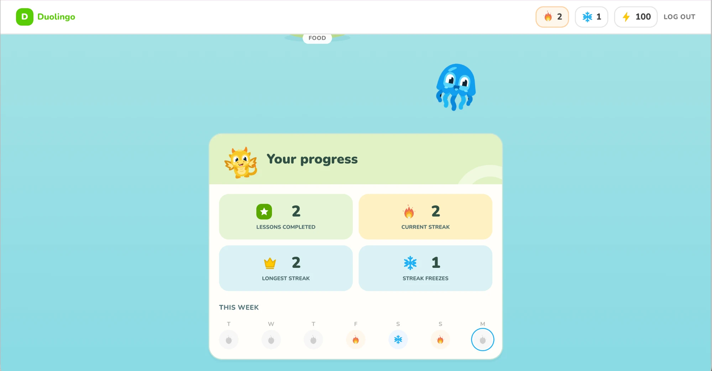
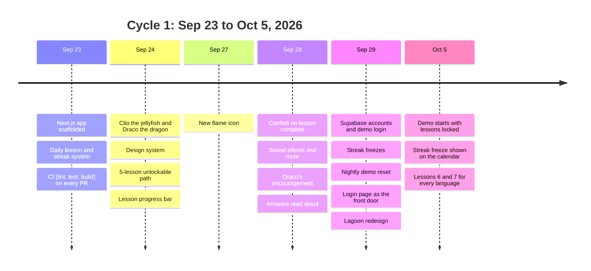
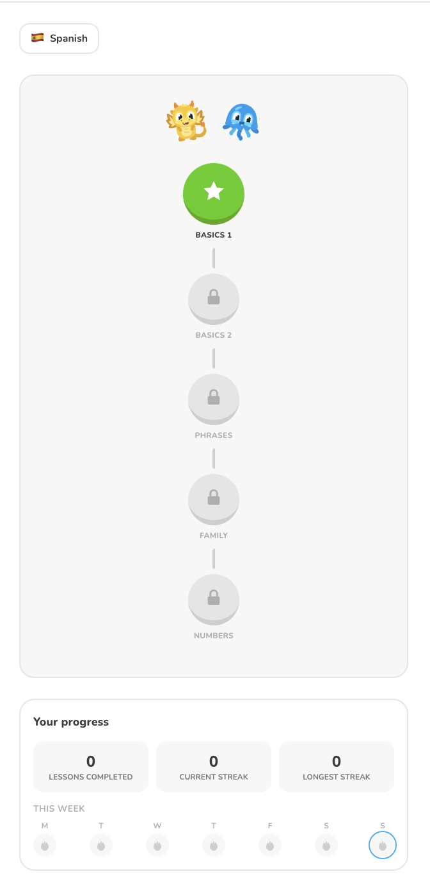
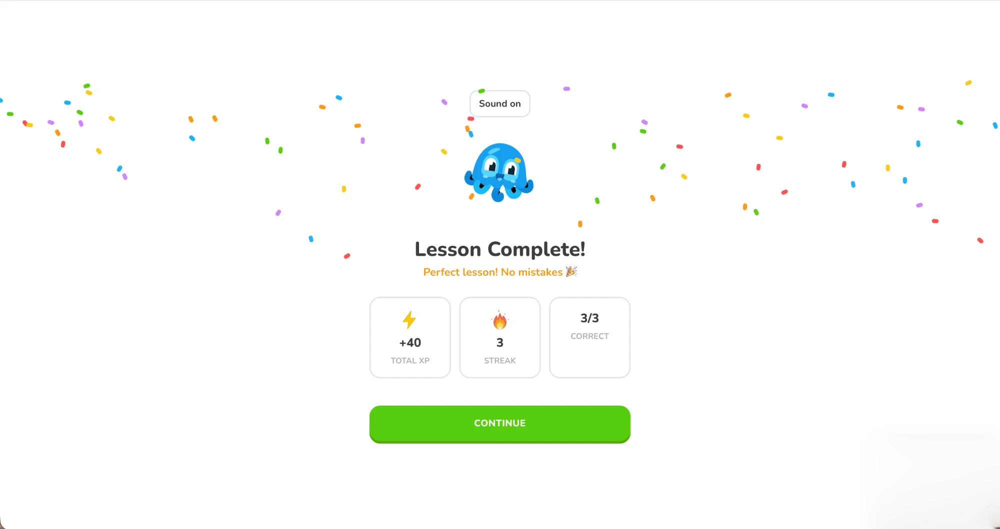

<div align="center">

# 🐉 Duolingo Clone

**Learn a language. Build a streak. Have fun.**

Bite-sized lessons in 🇪🇸 Spanish, 🇫🇷 French and 🇯🇵 Japanese, with daily streaks, streak freezes and real accounts.

### 👉 [**Try it live: duolingo-clone-pursuit.vercel.app**](https://duolingo-clone-pursuit.vercel.app) 👈

Click **Try the demo** to jump straight in, no sign-up needed.

### 🎬 Watch the demo

https://github.com/user-attachments/assets/afa2af29-3022-408f-ad1a-9a2bcc370d96

Video not playing? [Open it here](docs/video/duolingo-clone-demo.mp4).


</div>

---

## 📚 Table of contents

- [🎯 The problem](#-the-problem)
- [✨ The two features](#-the-two-features)
- [🧭 How we chose our two features](#-how-we-chose-our-two-features)
- [📸 Screenshots](#-screenshots)
- [🗓️ Two weeks of progress](#️-two-weeks-of-progress)
- [👥 Who did what](#-who-did-what)
- [📈 KPIs and business value](#-kpis-and-business-value)
- [❄️ How streak freezes work](#️-how-streak-freezes-work)
- [🔐 Accounts with Supabase](#-accounts-with-supabase)
- [🎮 The demo account](#-the-demo-account)
- [🎧 Extra polish](#-extra-polish)
- [🛠️ Run it locally](#️-run-it-locally)
- [🧪 Quality checks](#-quality-checks)
- [🗂️ Project structure](#️-project-structure)

---

## 🎯 The problem

Our assignment was to **clone an existing product and rebuild two of its core features**. We picked **Duolingo**.

Learning a language takes a little practice every day, and most people quit within the first few weeks. Duolingo's answer is a **habit loop**: a short daily lesson, a reward when you finish, and a **streak** that makes you want to come back tomorrow. When you miss a day, a **streak freeze** saves your streak, so one bad day doesn't make you give up.

So the problem we needed to solve was:

> **How do we get a beginner to practice a little every day, and keep coming back?**

---

## ✨ The two features

### 1️⃣ The Learning Path: daily lessons, progress and streaks

- 🌍 Pick a language: Spanish, French or Japanese.
- 🗺️ Follow a **7-lesson path** per language. Each lesson unlocks only after you finish the one before.
- ✅ Two exercise types: **multiple choice** and **word bank** (build the sentence from tiles).
- 🔁 Wrong answers show the correct one, and you retry before moving on.
- ⭐ Earn **XP**, with a bonus for a perfect lesson.
- 🔥 Build a **daily streak**. The flame pulses when your streak is at risk because you haven't done today's lesson.
- 📅 See your week on a **streak calendar**, plus lessons completed and current and longest streak.
- 🏋️ Replay finished lessons as **practice**.

### 2️⃣ The Streak Freeze, with accounts backed by Supabase

- ❄️ **Streak freezes** protect your streak when you miss a day.
- 🔐 **Sign up and log in** with email and password, or click **Try the demo**.
- ☁️ Your progress is saved to your account, so it follows you to any device.
- 🛡️ Streak and freeze rules run **on the server**, so nobody can give themselves a fake 999-day streak.

---

## 🧭 How we chose our two features

### 💡 Why the Learning Path and the Streak Freeze

Duolingo has many features: leagues, hearts, gems, friends, stories and more. We asked which two do the most to solve our problem of getting people to practice daily and keep coming back. The answer was the pair that makes the habit loop work.

**🗺️ The Learning Path gives people a reason to start every day.**
- It shows exactly what to do next, so a beginner never wonders where to begin.
- Unlocking the next lesson is a small win that pulls you forward (💪 engagement).
- Seeing finished lessons pile up makes progress visible, which keeps motivation up.
- It's Duolingo's signature screen, so a clone without it wouldn't feel like Duolingo.

**❄️ The Streak Freeze gives people a reason not to quit.**
- The streak is Duolingo's strongest retention tool, but it has a weak spot: one missed day resets it to zero, and that's when many people give up.
- A freeze turns that breaking point into a save, so the streak survives a bad day (🔁 retention).
- It's an item Duolingo itself sells for in-app gems, so it's also our clearest path to 💰 revenue later.
- A fair freeze needs rules the user can't edit, so it pushed us to build real accounts and a server-side backend. That was our biggest technical stretch.

**Together:** the path brings people in each day, and the freeze stops one missed day from ending the habit.

### 🎯 MoSCoW

| Priority | What we put there |
|---|---|
| ✅ **Must have** | Learning path with lessons that unlock in order · multiple choice and word bank exercises with feedback · XP · daily streak · **streak freeze** · saved progress with accounts |
| 👍 **Should have** | One-click demo login · week streak calendar · works on phones · automatic checks on every pull request |
| 🙂 **Could have** | Sound effects · read aloud · confetti · Draco's encouragement · lagoon theme · practice mode |
| ⛔ **Won't have (this cycle)** | Leagues and leaderboards · hearts and lives · gem shop and payments · speaking exercises with a microphone · friends · push notifications · moving local progress into a new account |

### ⚖️ Impact / Effort

| | 🪶 Low effort | 🏋️ High effort |
|---|---|---|
| **🚀 High impact** | ⚡ **Quick wins:** XP · streak calendar · confetti · sound effects | 🎯 **Big bets:** **Learning Path** · **Streak Freeze** · accounts with Supabase |
| **🐢 Low impact** | 🧩 **Fill-ins:** mascots · branding · flame icon | 🚫 **Not now:** leagues · payments · speech recognition · notifications |

Both core features are **big bets**: worth the effort because they drive the habit loop directly. We filled the gaps with quick wins that make the loop feel rewarding.

### 🏆 Product priorities

1. 🔁 **The habit loop comes first.** Every feature had to help people start a lesson or come back tomorrow.
2. 🛡️ **Progress you can trust.** Streaks are enforced on the server and saved to your account, so they can't be faked or lost.
3. 🚪 **Zero-friction trial.** Anyone can try the full app in one click with the demo.
4. 🎉 **Delight at the right moments.** Sound, voice, confetti and Draco reward finishing.
5. ✂️ **Keep running costs low.** Browser-made sounds and voices, and a demo that resets itself.

### 🆕 New information

Things we learned during the two weeks that changed our plan:

- 📈 **One lesson a day was too thin.** We started with a single daily lesson, then replaced it with an unlockable path so people who want more can keep going. The streak still counts days, not lessons.
- ❄️ **The freeze needed a server.** Our first plan deferred streak freezes. We realized a freeze saved only in the browser could be edited by anyone, so we built it together with accounts and server-side rules.
- 🚪 **Login became the front door.** Putting the app behind the login page ended guest play. We accepted that trade-off and added the one-click demo so trying the app stays easy.
- 🧹 **A shared demo gets messy.** Anyone can change the demo account, so we added a nightly reset and a Reset demo button.
- 🎮 **The demo has to tell the story.** The first demo had every lesson already done, which hid the path, and it never showed a freeze. We changed it to show lessons locked and a used freeze on the calendar.
- 🗣️ **Browser voices vary.** Read-aloud quality depends on the device, and native-speaker review of pronunciation is still needed.

---

## 📸 Screenshots

### 🏝️ The landing page

<div align="center">

</div>

### 🗺️ The Learning Path

The demo account: Basics 1 and 2 are done ✅, Phrases is ready to start ⭐, and the rest are locked 🔒.

<div align="center">

</div>

### ✅ Exercises and feedback

| Right answer 🟢 | Wrong answer 🔴 |
|:---:|:---:|
|  |  |
| "Nicely done!" and a happy sound | The correct answer is shown, and you retry it before moving on |

<div align="center">

**🧩 Word bank, with Draco the dragon cheering you on 🐉**



</div>

### 🎉 Lesson complete

<div align="center">

</div>

### ❄️ Streak and streak freeze

The calendar shows two 🔥 lesson days with a ❄️ frozen day between them, so the streak survived.

<div align="center">

</div>

### 🐉 Meet the mascots

<div align="center">


The dragon, **Draco**, guides you along the path, and **Clio the jellyfish** celebrates with you! 🎉🥳

</div>

---

## 🗓️ Two weeks of progress

We went from an empty repo to a deployed app with accounts in **two weeks (September 23 to October 5, 2026)**.



### 🔄 Before and after

| 😶 First draft | 🚀 Now |
|:---:|:---:|
|  |  |
| A plain grey card, a straight 5-lesson list, no accounts, stats at zero | A lagoon map with islands, a "Start here" guide, 7 lessons, and streak ❄️ freeze and XP badges |

| | 😶 Before (Sep 23) | 🚀 After (Oct 5) |
|---|---|---|
| **Lessons** | None | 7-lesson paths in 3 languages |
| **Progress** | None | XP, streaks, streak freezes, week calendar |
| **Accounts** | None | Supabase accounts and a one-click demo |
| **Feel** | Silent and static | Sound, spoken answers, confetti, Draco cheering you on |
| **Look** | Default | Lagoon-themed landing page and lesson map |
| **Quality** | None | CI on every PR, unit tests, SQL streak tests |

---

## 👥 Who did what

### 🟢 Soma: the core loop, accounts and streaks

- 🏗️ Set up the project (Next.js, TypeScript, Tailwind) and the CI pipeline.
- 📖 Built the **daily lesson and streak system**: exercises, XP, streak logic, the week calendar.
- 🗺️ Turned the single lesson into an **unlockable path**, later extended to 7 lessons per language.
- 🎨 Wrote the **design system** and added the mascots, **Clio the jellyfish** and **Draco the dragon**.
- 📊 Added the lesson progress bar and fixed the skipped lesson-complete screen.
- 🛡️ Made saved progress resistant to corrupted browser data.
- 🔐 Built **Supabase accounts**, the **Try the demo** login and the login gate.
- ❄️ Designed **streak freezes**, with the rules enforced on the server and tested in SQL.
- 🌙 Added the **nightly demo reset** with pg_cron.
- 🐛 Fixed the demo so its lessons start locked and its calendar shows a used freeze.

### 🔵 Shawn: the celebration moment

- 🎉 Added the **confetti animation** after every completed lesson, so finishing feels like a win.



### 🟠 Dennys: sound, voice and the lagoon look

- 🔊 Added **sound effects** for right and wrong answers, with a mute button.
- 🐉 Added **Draco's encouragement**: Draco cheers you on and reacts to your answers.
- 🗣️ Made answer choices **read aloud** in a voice that matches the language, including native Japanese.
- 🏷️ Restored the Duolingo branding across the site.
- 🏝️ Redesigned the landing page and lesson map with a **lagoon theme**, including an unlock animation.
- ✍️ Moved the landing copy beside the login form.

---

## 📈 KPIs and business value

We judged every feature against **four KPI categories** and **four value levers**.

| KPI category | The question it answers |
|---|---|
| 🧲 **Acquisition** | Do new people arrive and try it? |
| 💪 **Engagement** | Do they actually do lessons? |
| 🔁 **Retention** | Do they come back? |
| 💰 **Revenue** | Will they pay? |

**Value levers:** 💰 revenue · 🔁 retention · ✂️ cost reduction · 🌟 differentiation

### 🧾 Scorecard

| Feature (owner) | KPI | Value lever | Metric to watch |
|---|---|---|---|
| Lessons and unlockable path (Soma) | 💪 Engagement | 🔁 Retention | Lessons per active day |
| Streaks and streak freezes (Soma) | 🔁 Retention | 🔁 Retention | Return rate after 7 days, streak length |
| Accounts and one-click demo (Soma) | 🧲 Acquisition | ✂️ Cost reduction | Share of visitors who try the demo |
| Confetti (Shawn) | 💪 Engagement | 🔁 Retention | Next lesson started right after finishing |
| Sound, voice and Draco (Dennys) | 💪 Engagement | 🌟 Differentiation | Lesson completion rate |
| Lagoon redesign (Dennys) | 🧲 Acquisition | 🌟 Differentiation | Sign-up conversion |

**Why these matter:**

- 🔁 **Streak freezes protect retention.** People who lose a long streak often quit. A freeze keeps them in.
- ✂️ **Low running costs.** Sounds are generated in the browser and voices are the browser's own, so there are no audio files to host and no paid speech service. The demo resets itself every night, so nobody has to clean it up.
- 💰 **Revenue is the open gap.** Nothing is paid yet. The natural first paid item is the streak freeze, which Duolingo itself sells for in-app gems.

> 📏 These are the metrics each feature *should* move. We haven't added analytics yet, so measuring them is the first job for the next cycle.

---

## ❄️ How streak freezes work

- 🔥 Your streak grows by 1 on the first lesson you finish each day. Extra lessons the same day earn XP but don't double count.
- 🎁 You **earn a freeze** every time your streak hits a multiple of 7 days, up to **2 in stock**.
- 😴 Miss a day? When you next open the app, a freeze is **spent automatically** to cover it, and the day shows a **snowflake ❄️** on your calendar.
- 💔 Not enough freezes to cover the missed days? The streak resets to 0, and you keep any freezes you had.
- 🛡️ All of this runs in Supabase database functions (`reconcile_streak`, `complete_lesson`), so the browser can't edit the counters.
- 🧪 The rules are covered by [`supabase/tests/streak_freeze.sql`](supabase/tests/streak_freeze.sql).


---

## 🔐 Accounts with Supabase

- ✉️ **Email and password** sign-up and login through Supabase Auth.
- 👤 A **profile** is created automatically for every new user.
- 🗄️ Three tables: `profiles`, `lesson_completions` and `streak_freeze_events`.
- 🔒 **Row-level security**: you can only read your own rows, and you can never write the counters directly.
- 🌐 The browser sends its local date, because "a day" means *your* day. The server only accepts dates within one day of today, to stop abuse.
- 🚪 The login page is the front door. Signed-out visitors are sent to `/login`, and signed-in visitors go straight to their lessons.
- 💾 Without Supabase configured (local development, CI), the app falls back to saving progress in the browser.

---

## 🎮 The demo account

Click **Try the demo** on the [live site](https://duolingo-clone-pursuit.vercel.app) to explore without signing up. The demo is set up to show every feature:

- 🔥 **2-day streak** (longest: 2)
- ❄️ **1 streak freeze** in stock, plus one already used on the calendar
- ✅ **Lessons 1 and 2 done** in every language, lesson 3 ready to start, lessons 4 to 7 locked
- ⭐ **100 XP** and 2 lessons completed

| 3 days ago | 2 days ago | Yesterday | Today |
|:---:|:---:|:---:|:---:|
| 🔥 Lesson 1 | ❄️ Freeze used | 🔥 Lesson 2 | ⏳ Your turn |

The demo is shared, so anyone can change it. It **resets itself every night at 08:00 UTC**, and there's a **Reset demo** button on the home page.

---

## 🎧 Extra polish

- 🔊 **Sound effects:** original Web Audio tones for right and wrong answers and for finishing a lesson. No audio files, no extra packages. There's a Sound on/off button, and your choice is remembered.
- 🗣️ **Read aloud:** picking an answer or a word tile reads it in a matching browser voice. Japanese choices show romaji but are spoken from native script. It has its own on/off toggle. No API key or microphone needed.
- 🐉 **Draco's encouragement:** after your second correct answer, Draco the dragon appears with a speech bubble cheering you on. Draco flaps on correct answers and looks sad on wrong ones.
- 🎉 **Confetti** when you finish a lesson.
- ✨ **Unlock animation** when a new lesson opens.
- ♿ **Reduced motion respected:** animations turn off if your device asks for reduced motion.

---

## 🛠️ Run it locally

```bash
npm install
npm run dev
```

Open [http://localhost:3000](http://localhost:3000).

### 🔑 Connect Supabase (optional)

Copy `.env.example` to `.env` and fill in:

| Variable | What it is |
|---|---|
| `NEXT_PUBLIC_SUPABASE_URL` | Your project's base URL, e.g. `https://<ref>.supabase.co` |
| `NEXT_PUBLIC_SUPABASE_ANON_KEY` | The anon (publishable) key. Never the service role key. |
| `NEXT_PUBLIC_DEMO_EMAIL` | `demo@duolingo-clone.test` |
| `NEXT_PUBLIC_DEMO_PASSWORD` | The demo account's password (public by design, never a real one) |

Then, in the Supabase dashboard:

1. Run the migrations in `supabase/migrations/` **in order** in the SQL Editor (`0001` to `0004`).
2. Create the demo user `demo@duolingo-clone.test` under **Authentication → Users**.
3. Run `select public.reset_demo_nightly();` to set up the demo account.

### 👀 Preview the landing page without Supabase

With `npm run dev` and no Supabase settings, [localhost:3000/login](http://localhost:3000/login) shows the full landing page as a design preview. The form and demo button show a notice instead of signing in. Production builds never enable this preview.

---

## 🧪 Quality checks

Every pull request and every push to `main` runs **lint, tests and a production build** in GitHub Actions.

```bash
npm run lint   # ESLint
npm test       # unit tests: voice selection, unlock animation
npm run build  # production build
```

The streak and freeze rules have their own SQL test: run [`supabase/tests/streak_freeze.sql`](supabase/tests/streak_freeze.sql) in the Supabase SQL Editor. Success shows as `ALL STREAK FREEZE TESTS PASSED`.

---

## 🗂️ Project structure

```
src/
  app/               pages: home, /login, /lesson/[index], practice
  components/        lesson path, exercises, mascots, confetti, calendar
  hooks/             auth, progress, language, sounds, speech
  lib/               lesson content, streak logic, Supabase client
supabase/
  migrations/        database schema, streak rules, demo setup
  tests/             SQL tests for streak freezes
tests/               unit tests
DESIGN_SYSTEM.md     colors, components and conventions
```

---

<div align="center">

Made with 💚 by **Soma**, **Shawn** and **Dennys**

</div>
